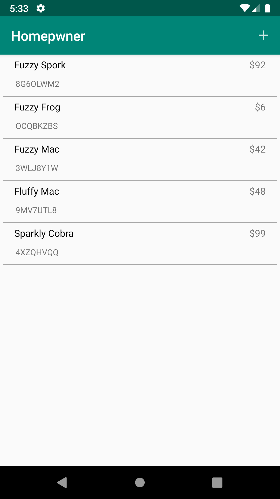
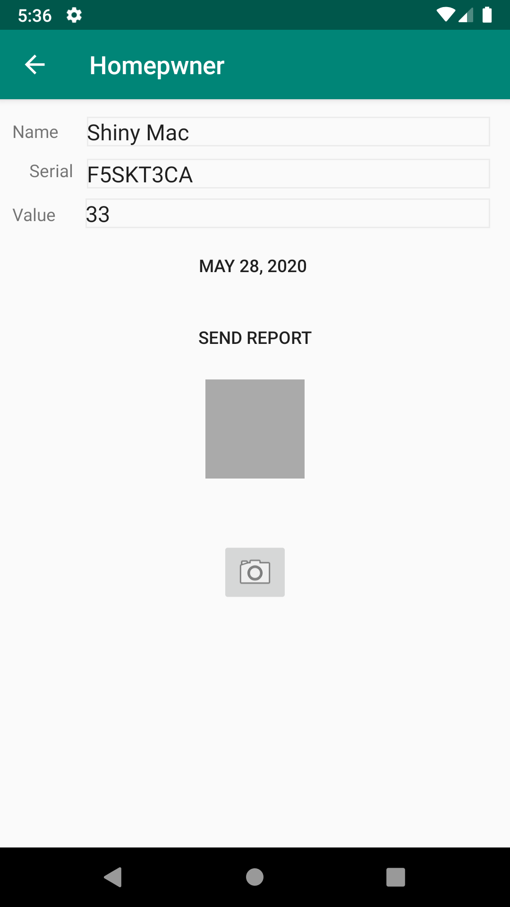
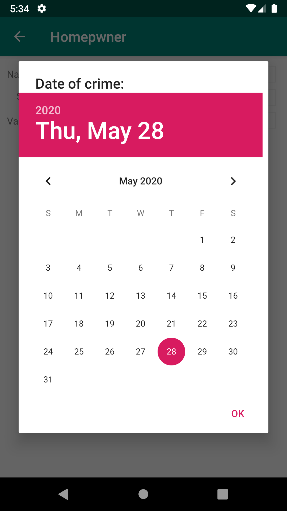
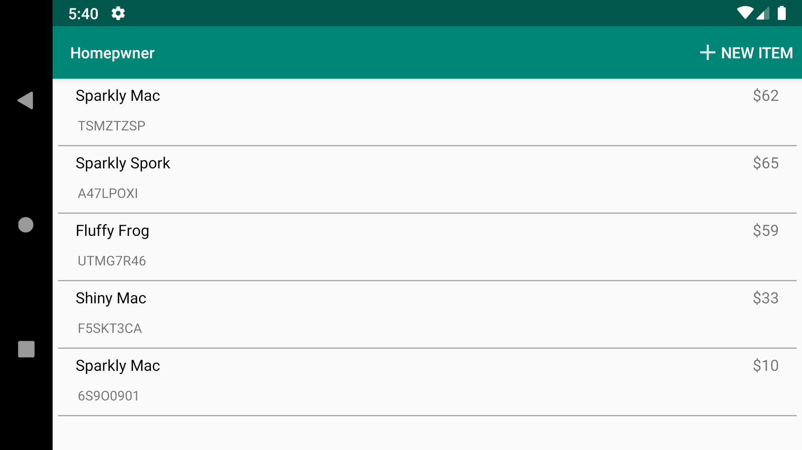
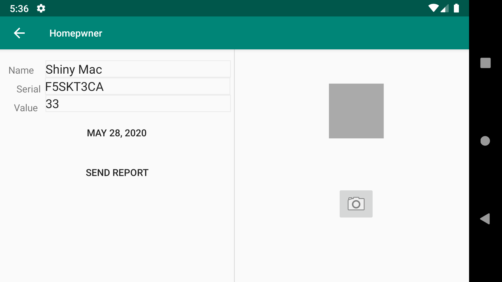

# Learning-Android-App
Worked with Android Studio to create this app that uses different application programming concepts such as ListViews, localization, and the Android ViewPager. Unique serial numbers, titles, and prices are created for each item created in the application, and these numbers change each time the app is run.

# Screenshots
                                     
